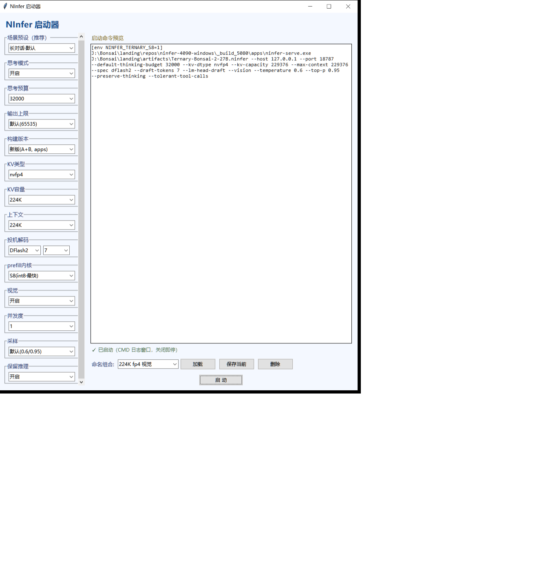

# Bonsai-27B-NInfer — RTX 5080 三元量化部署工程

> 在 **RTX 5080（16GB，sm_120a）** 上把 **Bonsai-2-27B 三元量化模型**（`Ternary-Bonsai-2-27B.ninfer`，2.125bit / 9.81 GiB / 1192 对象）与 **NInfer 引擎** 跑通、压榨到极限的完整工程。
> 技术起点：沈三殊《三元-Bonsai-27B-NInfer-移植-技术论文-20260920》。本项目自 2026-09-21 立项起全程落地于本仓（`paicat1/Bonsai-27B-NInfer`）。

---

## 这个仓库怎么用（两分支一体）

一个仓库、两个分支，**配合起来才是一个完整项目**：

| 分支 | 角色 | 内容 |
|---|---|---|
| **`main`**（本分支） | **项目层** | 启动器、起服 BAT、构建史/报告/方案文档、技术论文、制品、作者工具链 |
| **`engine-main`** | **引擎层** | NInfer 引擎完整 C++/CUDA 代码 + 本 fork 的全部改动（A/B、s8/wide_t、frontend 修复） |

- 要看**引擎代码、怎么改引擎、怎么重编** → 切到 `engine-main`，读它的 `README.md`（复现索引）。
- 要看**整个项目怎么跑起来、历史、报告、档位** → 留在 `main`，读下面的目录导航。

## 快速上手（起服）

双击根目录 `起服-*.bat`（各档位现成命令，改路径即用）。档位一览与实测速度见引擎 `README.md` 第三节表格。
图形化方式：运行 `ninfer_launcher.py`（GUI 启动器，可下拉选上下文/KV/投机/思考预算/prefill/视觉 档并保存 profile）。

### 启动器（GUI）使用说明

`ninfer_launcher.py` 是本项目的图形化启动入口（作者分发包只有 bat，本项目自建 GUI）。左侧参数面板可下拉配置：**场景预设**（内置组合一键切换）、**思考模式/预算**、**输出上限**、**构建版本**（新版 A+B / 旧版）、**KV 类型**（bf16/int8/fp8/nvfp4/k8v4/rk4v4）、**KV 容量**、**上下文长度**（32K~256K）、**投机解码**（MTP K1-5 / DFlash2 K1-15）、**prefill 内核**（S8 最快 / wide / mma）、**视觉**、**并发度**、**采样**、**保留推理**。右侧实时显示生成的启动命令行，底部可保存/加载/删除组合 profile。

> 截图即本次新增的 **`224K fp4 视觉`** 档（nvfp4 KV + 224K 上下文 + DFlash2 K=7 + 视觉开启）：



> serve 的启停一律由你自己双击 BAT 完成；本工程不主动用隐藏窗口拉起。

### 当前推荐参数配置（作者实测日常档，2026-09-28）

本项目目前推荐使用的启动参数（即 `224K fp4 视觉` 档的生成命令，作者本人日常使用）：

```
[env NINFER_TERNARY_S8=1] J:\Bonsai\landing\repos\ninfer-4090-windows\_build_5080\apps\ninfer-serve.exe
  J:\Bonsai\landing\artifacts\Ternary-Bonsai-2-27B.ninfer
  --host 127.0.0.1 --port 18787
  --default-thinking-budget 32000
  --kv-dtype nvfp4 --kv-capacity 229376 --max-context 229376
  --spec dflash2 --draft-tokens 7 --lm-head-draft
  --vision --temperature 0.6 --top-p 0.95 --preserve-thinking --tolerant-tool-calls
```

参数要点：**nvfp4 KV**（224K 满上下文，省显存）+ **DFlash2 K=7**（英文/代码投机）+ **--vision**（视觉开启）+ **思考预算 32000** + **S8 prefill 内核**。对应启动器里「224K fp4 视觉」档。在此配置下，**prefill 实测峰值达 2.85k tok/s**（见下）。

## 目录导航

| 路径 | 内容 |
|---|---|
| `起服-*.bat` / `ninfer_launcher.py` | 各档位启动脚本 + GUI 启动器 |
| `docs/项目构建史.md` | 完整开发史（M0–M7 逐日原始记录 + 09-25 后优化），**读它了解全局** |
| `docs/reports/` | 各里程碑报告（M0–M6 + CraneBW 方案与验证 + 上游 A/B 移植） |
| `docs/ninfer-思考区空正文问题与治本方案-20260927.md` | 思考区空收尾问题分析与方案 C 设计（引擎单请求 Bug） |
| `docs/雷霆大思考死循环-客户端复合现象分析.md` | 雷霆大思考跨轮死循环：客户端多条件耦合现象（引擎无缺陷）分析与思考预算帽伪方案辨析 |
| `落地实施方案-Bonsai27B-NInfer-20260921.md` | 立项方案定稿（v1.2） |
| `三元-...-技术论文-20260920.pdf` | 上游作者技术论文（宪法级输入） |
| `landing/artifacts/` | 三元制品 + bf16 模板 + 转换报告 |
| `landing/tools/` | 作者工具链（ninfer-ada-ternary）+ 运行时 shim |
| `landing/repos/` | 引擎仓库（另立 `engine-main` 分支）+ CraneBW 上游克隆 |
| `landing/backups/` | 各阶段回退资产 |

> 引擎代码本身在 `engine-main` 分支的 `landing/repos/ninfer-4090-windows/`，本分支下的同名目录不重复跟踪引擎源码。

## 关键结论（速览）

- **能跑**：PPL **6.1129**（判据 ≤6.8，智力不塌）。
- **省显存**：16GB 卡全程运行，k8v4 256K 满上下文满血 15.36 GiB。
- **快（5080 实测，10-01 真实负载配对）**：
  - **DFlash2 K=7 = 速度优先档（启动器默认）**：180K/nvfp4 端到端 **230~245 tok/s**、解码峰值 **303 t/s**、prefill 最高 **2.68k tok/s**；
  - **MTP K=3 = 省显存档**：端到端 **195 tok/s**、解码稳 **118~182 t/s**，但比 DFlash2 **少占 1.65 GiB**（草稿权重 7.45 vs 9.10 GiB），接受率均值高 19pp、上下限更稳。长文档档位余量紧时选它；
  - **投机 K 值不是越大越好**：DFlash2 K≥10 断崖式崩塌（比不开投机还慢 70%+）属**禁用区**；MTP K=1~5 吞吐基本持平，K=2 并非最优点；
  - **prefill_chunk 默认 1024 就是甜点**：256 是坑（**−40%**，小 chunk 放大单元边界往返），4096 与 1024 打平但多占 0.68 GiB 显存；
  - **S8 预填充内核**：prefill 最高 **2.85k tok/s**（A3 调度优化后，实测），峰值解码**摸到 396 t/s**。
- **视觉**：引擎支持 `--vision`（内置视觉塔），启动器"视觉"开关开启即可用图片输入（默认档关闭）。
- **长思考异常分两类**（易混淆，排查先定性）：① `frontend.cpp` 单请求空收尾（引擎 Bug，已修复，见 `docs/ninfer-思考区空正文问题与治本方案-20260927.md`）；② 雷霆大思考跨轮死循环（客户端多条件耦合、引擎无缺陷，见 `docs/雷霆大思考死循环-客户端复合现象分析.md`）。前者改引擎、后者靠业务层规避，根因与处理完全不同。

> **5080 实测截图**（modlens 运行日志，2026-09-27）：
> 
> 

## 近期优化速览（2026-09-27 ~ 09-28）

- **A3 token-grid 调度移植**（引擎 `engine-main` `4c9a4f5`）：**针对 prefill（预填充）的专项优化**——沈三殊"sched3"调度的核心，把 token tile 铺进 `blockIdx.y`，大幅提升 prefill 并行度，**prefill 实测 +31%**（实测峰值 **2.85k tok/s**，为 A3 优化的直接成果），逐位一致不改变数值。只做 s8 + wide_t 两路，`NINFER_TERNARY_TOKEN_GRID` 开关（默认开）。
- **nvfp4 KV 长上下文放开**（`2c7a1ea`）：224K/256K 的 KV 白名单从「仅 k8v4」扩为「k8v4 或 nvfp4」——nvfp4 KV 每 token 288 字节，比 k8v4（401 字节）**省约 28%** 显存；配套新增 `224K fp4 视觉` 档。
- **上下文档位扩充**：启动器新增 **150K/160K/170K/180K/200K** 档，224k 修正为 229376（名副其实）。
- **思考区空收尾修复**（方案 C，引擎 `145bccb`）：长思考模型 stop 时强制切正文区，杜绝"想完无正文"，实测 78 请求无空收尾。
- **启动器 GUI 化 + S8 prefill**：`ninfer_launcher.py` 图形界面（上下文/KV/投机/思考预算/prefill/视觉 下拉 + profile 保存）；s8 int8 prefill 内核冷 prefill 1.63k tok/s。

详细记录见 `docs/项目构建史.md` 第十节。

## 近期优化速览（2026-09-30 ~ 10-01）

- **投机档位结论修订（合成 → 真实负载）**：12 档合成扫描曾得出"推荐 MTP K=3、DFlash2 全面落后"，**该结论已被真实负载配对实测推翻**——同任务、同 180K 深度、唯一变量=spec 的三轮对照显示 DFlash2 K=7 端到端快 5~25%。根因：合成填充文本的**接受率**与真实会话差 2.5 倍（接受率是强内容依赖指标，decode 速率才可合成测）。最终结论：**DFlash2 K=7 速度优先（默认）/ MTP K=3 省显存**。
- **方案 A（s8 chunk 级直解）完全回退**：短上下文打平、长上下文崩溃（>70K 退化 −29%，三条请求崩在尾部），且 union 让默认 step 路径也吃 −5.2% 代价。等价性副产物有价值——chunk 与 step 输出**逐字一致 + SHA256 相同**，未来任何解码重排可复用这套 bit-exact 验证手法。现场存 `.temp/chunk_experiment_20260930.patch`。
- **prefill_chunk 三档扫描**：256 / 1024 / 4096 判据统一改用**引擎自报值**（客户端 `prompt_tokens/TTFT` 口径系统性低估约 6%）。结论：1024 是甜点且已是默认，**代码与启动器一行未改**。
- **全量日志聚合统计（09-21 → 10-01，88 份 serve 日志 / 1,673 请求）**：prefill 峰值逐日爬升 1,380（09-25）→ 1,450（s8 落地）→ 2,400（A3 移植）→ **2,730**（10-01）；全局 decode 峰 362.8、prompt 峰 150,798。池化前必须剔除异常轮次，否则结论会反转。

详细记录见 `docs/项目构建史.md` 第十节末三节。

## 鸣谢（上游作者）

本项目是站在巨人的肩膀上落地，向所有上游作者与贡献者致谢：

- **沈三殊（shensanshu）**：三元-Bonsai 技术论文作者，发布 [`shensanshu/ninfer-ada-ternary`](https://modelscope.cn/models/shensanshu/ninfer-ada-ternary)（ModelScope），提供三元补丁、pack.py 转换、MAPPING 与 verify 工具链——本项目的技术起点。
- **Neroued**：NInfer 官方上游作者（C++20/CUDA，DFlash2/ReplaySSM/Paged KV），模型制品发布者。[`Neroued/ninfer`](https://github.com/Neroued/ninfer)
- **UDPSendToFailed**：原始 **RTX 4090 fork** 创造者，WDDM evictable-budget bypass 先驱，E8 lattice（Conway-Sloane）几何量化 / rk4v4-e8 发明者——我们的 k8v4 属该量化族变体。[`UDPSendToFailed/ninfer-4090`](https://github.com/UDPSendToFailed/ninfer-4090)
- **CraneBW**：`ninfer-ternary-bonsai-ada` 第三方优化内核作者（[`CraneBW/ninfer-ternary-bonsai-ada`](https://github.com/CraneBW/ninfer-ternary-bonsai-ada)），本项目合并其内核后 prefill 2.41x、日常档 +59%。
- **Ambolio**：`ninfer-4090-windows` 整合者（v1.0.8 = 多 fork 融合），本地引擎基线来源（该仓库已转私有，故不附链接）。
- **sergiuszm**（sm_89 kernel 优化 / rk4v4-e8 适配）、**natpate**（Win32/MSVC 可移植层）、**headpiece747**（5090 Windows MSVC 基座）、**Don-Chad**（3090 Ampere 先驱）、**dylanbrodiefafard / nmorgowicz**（v1.0.8 两个 frontend port）：[sergiuszm](https://github.com/sergiuszm) · [natpate](https://github.com/natpate) · [headpiece747](https://github.com/headpiece747) · [Don-Chad](https://github.com/Don-Chad) · [dylanbrodiefafard](https://github.com/dylanbrodiefafard) · [nmorgowicz](https://github.com/nmorgowicz)
- **模型根基**：Qwen Team（阿里）架构 + unsloth NVFP4 量化 + z-lab DFlash 权重。

详细上游血统见 `docs/项目构建史.md` §二。

## 分支说明（本次变更）

本次补充：本 `main` 分支此前没有 README；新增此项目层入口，与 `engine-main` 的引擎 README 互链，两个分支配合使用。**引擎代码及其复现索引在 `engine-main` 分支**。